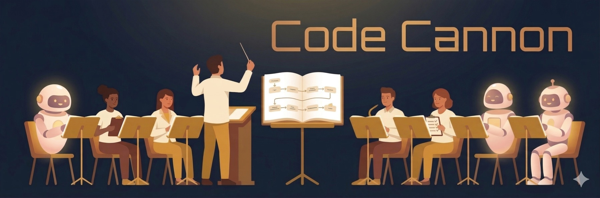
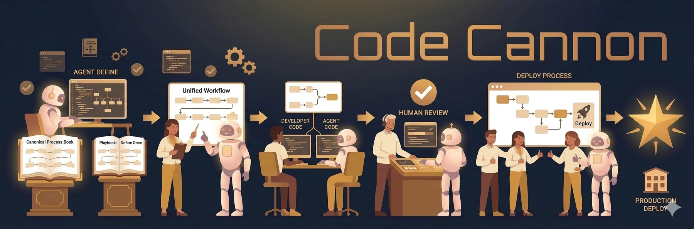

<h1 align="center">Code Cannon</h1>
<p align="center">
  <strong>Write your AI agent workflow once. Sync it everywhere.</strong>
</p>
<p align="center">
  Portable skills for Claude Code, Cursor, Gemini, and Codex — start, review, deploy — across all your projects.
</p>
<p align="center">
  <a href="https://github.com/LightbridgeLab/CodeCannon/actions/workflows/sync-check.yml"></a>
  <a href="https://github.com/LightbridgeLab/CodeCannon/actions/workflows/test.yml"></a>
  <a href="https://codecov.io/gh/LightbridgeLab/CodeCannon"></a>
  <a href="LICENSE"></a>
  <a href="https://github.com/LightbridgeLab/CodeCannon/releases"></a>
  <a href="https://github.com/LightbridgeLab/CodeCannon/commits"></a>
  <a href="docs/contributing.md"></a>
  <a href="sync.py"></a>
  <a href="https://github.com/LightbridgeLab/CodeCannon#quick-start"></a>
</p>

<p align="center">
  
</p>

## The problem

AI coding agents are powerful, but every project reinvents the same workflows: how to create issues, open PRs, run reviews, deploy releases. These instructions live in scattered prompt files, maintained per-project, per-agent, with no consistency and no reuse.

## The solution

Code Cannon is a repository of portable agent **skill groups** — each group is a focused, domain-specific bundle of skills in the [Agent Skills](https://agentskills.io) open-standard `<skill-name>/SKILL.md` format. A sync script reads your project config, picks the one group you've enabled, and renders project-configured skills into the standard directories your tools read:

```
skills/<group>/<name>/SKILL.md  →  sync.py + .codecannon.yaml  →  .claude/skills/<name>/SKILL.md   (Claude Code)
                                                               →  .agents/skills/<name>/SKILL.md   (Codex CLI, Cursor, Gemini CLI)
```

One source of truth for every project and every agent. Pick the group that matches how you work.

### Available groups

| Group | What it's for |
|---|---|
| `github-agile` | GitHub-based agile workflow — every change gets an issue, PR reviews required, releases via `/deploy` |

More groups (lighter solo flows, JIRA variants, RFP tooling, …) are planned. Each project enables exactly one group.

## What you get

A complete development workflow in five commands:

```
/start  →  [code + test]  →  /submit-for-review  →  [QA]  →  /deploy
```

| Command | What it does |
|---|---|
| `/start` | Create a GitHub issue, feature branch, and write code |
| `/submit-for-review` | Check, commit, open PR, run AI review, merge |
| `/review` | Standalone code review on any PR |
| `/deploy` | Bump version, create a GitHub Release, promote to production |
| `/status` | Standup-ready snapshot of PRs, issues, and progress |

Plus `/qa` for structured QA workflows and `/setup` for guided onboarding.



## Philosophy

**Humans stay in the loop.** The agent proposes; you approve. `/start` waits for your sign-off before creating anything. `/deploy` requires explicit confirmation.

**Every change has a ticket.** There is no path for code without an issue. The issue is the unit of work — branch, PR, and release all link back to it.

**Configure, don't fork.** Skills use `{{PLACEHOLDER}}` tokens. Your `.codecannon.yaml` fills them in. When upstream improves, pull the submodule and re-sync.

## What makes a good skill

Anyone can write a skill. What separates a good one from a bad one is not how thoroughly it dictates procedure — it is **token economy**, **respect for the developer's attention**, and knowing **which decisions belong to the workflow versus which belong to the agent**.

Early skills, written for weaker models, spelled out not just *what* outcome to produce but *how* to produce it: how to parse an argument string, what date format to use, which emoji maps to which CI state. Capable agents do all of that unaided. Over-specification looks rigorous and is actually fragile — it burns context on instructions the model does not need, it breaks whenever the underlying tool changes, and it stops a capable agent from doing something smarter than the author imagined.

Code Cannon holds every instruction to one test:

> **Prune where model variance produces a different-but-fine result. Keep where model variance produces a wrong result.**

Report formatting, argument parsing, and investigation method fall on the *prune* side — a differently-shaped-but-correct result is harmless. Ordering guarantees, human approval gates, platform behaviour a model cannot derive, and review policy fall on the *keep* side — variance there is a defect. Pulling back is **not** the same as removing constraints: everything that encodes a real rule stays exactly as it is. The skill authoring guidance in [`AGENTS.md`](AGENTS.md#skill-design-philosophy) applies this test in full, including the two categories — prompt-avoidance instructions and platform-behaviour notes — that read as noise but are load-bearing, and the reminder to calibrate against the weakest supported model, not the strongest.

## Quick start

Requires Python 3.8+ (stdlib only — no pip install needed).

```bash
git submodule add https://github.com/LightbridgeLab/CodeCannon.git CodeCannon
cp CodeCannon/templates/codecannon.yaml .codecannon.yaml
# Edit .codecannon.yaml — make sure `skill_group:` names the bundle you want
CodeCannon/sync.py
```

Then optionally run `/setup` for a guided walkthrough.

To update to the latest version:

```bash
CodeCannon/sync.py --update
```

## Documentation

- **[Getting started](docs/index.md)** — full quickstart, migration guide, and workflow details
- **[Branching models](docs/branching.md)** — trunk, two-branch, and three-branch workflows
- **[Customization](docs/customization.md)** — tailoring skills, sync.py reference
- **[Config reference](docs/config-reference.md)** — every `.codecannon.yaml` setting documented
- **[Adapters](docs/adapters.md)** — supported agents and how to add new ones
- **Skill reference:** [/start](docs/skills/start.md) · [/submit-for-review](docs/skills/submit-for-review.md) · [/review](docs/skills/review.md) · [/deploy](docs/skills/deploy.md) · [/qa](docs/skills/qa.md) · [/status](docs/skills/status.md) · [/setup](docs/skills/setup.md)

## License

[MIT](LICENSE)
